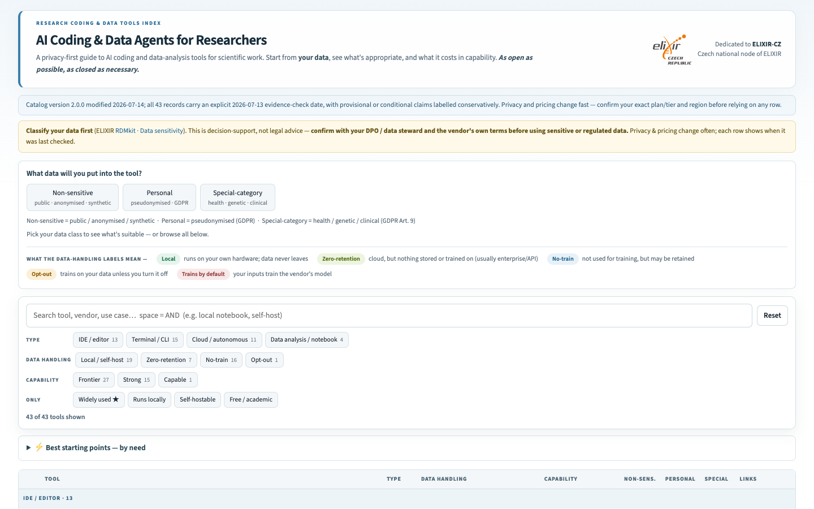

# AI Coding and Data Agents for Researchers

A privacy-first guide to AI coding and data-analysis tools for scientific work. Start with the sensitivity of your data, then compare suitable operating modes, access requirements, and capabilities.

**[Open the interactive index](https://michalie.github.io/research-coding-agents-wiki/)**

## What the index provides

- Data-sensitivity filters for non-sensitive, personal or pseudonymised, and special-category research data.
- Suitability labels tied to specific deployment modes, plans, or configurations.
- Data-handling summaries, capability tiers, access links, and evidence dates.
- Stable record identifiers, provenance, and machine-readable distributions.

The displayed catalog is generated deterministically from [`tools.json`](tools.json). Privacy, security, pricing, and product terms change frequently; every entry is a dated evidence summary rather than a permanent guarantee.

## Safety boundary

The index is decision support, not legal, ethics, security, procurement, or data-protection approval. Classify data with the [ELIXIR RDMkit guidance on data sensitivity](https://rdmkit.elixir-europe.org/data_sensitivity), consult your data steward or DPO, and verify current vendor and institutional terms before processing sensitive data.

As a conservative catalog policy, special-category data should remain in infrastructure under the research institution's control unless the institution has explicitly approved another arrangement. A cloud provider's contractual or technical safeguards do not by themselves establish permission for a particular dataset.

## Machine-readable access

- [Catalog JSON](https://michalie.github.io/research-coding-agents-wiki/tools.json)
- [JSON Schema](https://michalie.github.io/research-coding-agents-wiki/schema.json)
- [JSON-LD metadata](https://michalie.github.io/research-coding-agents-wiki/metadata.jsonld)

## Contribute

Suggest a tool or correction through the [structured issue form](https://github.com/MichaLie/research-coding-agents-wiki/issues/new?template=add-tool.yml). Contributions should point to current first-party documentation for data handling, deployment, access, and pricing claims.

## Maintain or fork

This repository includes its own reproducible maintenance system:

- [`MAINTENANCE.md`](MAINTENANCE.md) is the canonical safety-critical update, validation, and release protocol.
- [`AGENTS.md`](AGENTS.md) and [`CLAUDE.md`](CLAUDE.md) map coding agents to that protocol.
- [`build.py`](build.py) creates synchronized public distributions.
- [`validate_catalog.py`](validate_catalog.py) enforces schema, provenance, licence, and release checks.
- [`.github/workflows/quality.yml`](.github/workflows/quality.yml) runs the deterministic quality gate on GitHub.

Forks should replace the resource identity, creator, publisher, licence, and provenance metadata with claims they are authorized to make.

## Stewardship and licences

Curated and published by **Michaela Liegertová** ([michaela.liegertova@img.cas.cz](mailto:michaela.liegertova@img.cas.cz)), affiliated with the [Institute of Molecular Genetics of the Czech Academy of Sciences](https://www.img.cas.cz/en/). Dedicated to the [ELIXIR-CZ](https://www.elixir-czech.cz/) community.

IMG affiliation and the ELIXIR-CZ dedication provide context; they do not imply institutional publication authority or endorsement.

Catalog data, metadata, and original documentation are licensed under [CC BY 4.0](LICENSE-CONTENT.md). Maintenance and build software are licensed under the [MIT License](LICENSE-CODE). Vendor materials, software, services, logos, and trademarks retain their own terms.

See [`CHANGELOG.md`](CHANGELOG.md) for version history.
